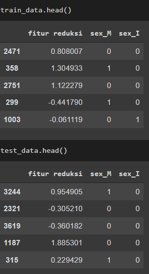

# Laporan Proyek Machine Learning - Zicola VLadimir

## Domain Proyek
untuk meningkatkan keuntungan dan mereduksi biaya pengeluaran maka penati kepiting wajib mengetahui kapan suatu kepiting harus dipanen, diluar dari ukuran tubuh kepiting itu sendiri. jika tubuh kepiting masih kecil tetapi usianya sudah cukup maka kepiting tersebut tetap akan dipanen untuk mereduksi biaya pembesaran.

## Business Understanding

bayangkan ada kepiting yang sudah memasuki usia panen tetapi secara visual mulai dari berat panjang dan ukuran lainnya seperti kepiting muda, pada umur dewasa rata-rata mahluk hidup sudah tidak bisa bertumbuh lagi, untuk itu walaupun kepiting tersebut memiliki ukuran yang kecil tatpai telah memasuki usia matang maka kepiting tersebut wajin dipanen sehingga tidak ada lagi biaya untuk memelihara kepiting yang tidak dapat bertumbuh besar lagi, sehingga terjadi peningkatan keuntungan dan pengurangan biaya.

### Problem Statements
Berdasarkan permasalahan diatas, akan dikembangkan suatu sistem untuk memprediksi umur kepiting, adapun rumusan masalah sebagai berikut.
1. fitur yang paling mempengaruhi umur kepiting?
2. cara mengetahui umur kepiting dengan fitur tertentu?

### Goals
Untuk menjawab rumusan masalah diatas, maka perlu dibuatkan sistem prediksi dengan goals sebagai berikut.
1. mengetahui fitur yang paling berpengaruh terhadap umur kepiting
2. membuat model ML yang akan memprediksi umur kepiting

Menggunakan 2 algoritma yang pertama dimulai dari algortima sederhana yaitu linear regression, lalu menggunakan algoritma KNN, serta algoritma SVR, lalu diukur dengan metric MAE.

## Data Understanding
Data ini diambil dari kaggle dengan judul crab age predicition yang dirilis 4 bulan yang lalu dengan link berikut https://www.kaggle.com/sidhus/crab-age-prediction
data ini berisi  3893 baris dengan 9 kolom dimana 8 kolom sebagai fitur dan 1 kolom target yaitu age.

### Variabel-variabel pada crab age detection dataset adalah sebagai berikut:
1. sex             : jenis kelamin kepiting
2. length          : panjang kepiting
3. Diameter        : diameter kepiting
4. height          : tinggi kepiting
5. weight          : berat kepiting
6. shcuked weight  : berat kepiting tanpa cangkang
7. viscera weight  : berat perut atau bisa juga disebut body fat
8. shall weight    : berat cangkang
9. age             : umur kepiting

dilakukan dataKepiting.info() untuk mengetahui apakah ada data yang null pada dataset kepiting tersebut dan pada hasil terlihat bahwa tidak ada data yang kosong

selanjutnya dilakukan describe untuk mengetahui nilai min pada dataset, apakah ada nilai fake null yaitu nilai yang tidak secara eksplisit null tetapi nilai tersebut 0.

setelah dilakukan terlihat bahwa nilai ada nilai yang valuenya 0 sebanyak 2 baris

selanjutnya akan di drop kedua data tersebut

pada sex terdapat 3 jenis kelamin yaitu m untuk male , f utk femail dan i untuk banci dan distribusi data untuk ke 3 jenis kelamin seimbang
 

pada data numerical terlihat bahwa umur paling banyak terdapat di umur 9 bulan,lalu berdistribusi normal
 

pada pairplot dan heatmap juga terlihat jelas bahwa data cenderung berkorelasi antar 1 sama lain sehingga akan terjadi multicollinearity , dan tidak bisa hanya dihapus karna hampir semua data berkorelasi sehingga diperlukan teknik pereduksian seperti PCA, karna tidak ada teknik untuk memilih fitur mana yang akan di pertahankan dilihat dari masing masing fitur yang saling berkorelasi
 
 

## Data Preparation
pada pertama mengubah data kategori menjadi angka dikarenakan algo ML pada dasarnya hanya menerima data berupa angka bukan teks, pada tahap ini digunakan teknil one hot encoding, lalu parameter digunakan adalah kolom yang ingin di ubah , lalu prefix dan pada kasus ini saya juga menggunakan drop_first untuk menghindari multicollinearity sehingga jika kolom yang dihasilkan 2 dari 3 , SEX_F pada kasus ini di drop karna jika SEX_I dan SEX_M sama 0 maka dapat dipastikan bahwa sex kepiting tersebut female
 

selanjutnya digunakan reduksi PCA, untuk mereduksi data tersebut serta menghilangkan kolom kolom yang berkorelasi sehingga tidak ada multicollinearity di data tersebut adapun sum of explained ratio yang saya pakai adalah minimal 90%.

pada grafik diatas terlihat benar bahwa hanya 1 pca yang diperlukan karena memang pada dasarnya semua kolom saling berkorelasi kuat. yang artinya pada dasarnya semua fitur tersebut sama pentingnya untuk menentukan age dan saling berkorelasi sehingga hanya diambil 1 pca

setelah dilakukan pca setelah itu dilakukan train test split menjadi data train dan data uji dengan persentasi 0.9 dan 0.1 lalu dilakukan standarisasi pada masing masing subset data agar data test tidak menangkap distribusi dari data train sehingga data test akan benar benar independent terhadap data train

## Modeling
dalam modelling disini digunakan 3 jenis model yakni linear regression, KNN dan SVR, untuk linear regression digunakan sebagai model dasar dikarenakan kesederhanaaan model tersebut, lalu KNN yang mudah diterapkan dan termasuk lazy learning sehingga tidak ada pelatihan tetapi pemilihan k harus sesuai sehingga tidak terjadi kesalahan dalam prediksi , lalu yang terakhir adalah SVR yang merupakan salah satu algoritma kompleks yang baik dalam regression dan termasuk ke dalam keluarga SVM.

pada linear regression tidak ada parameter yang digunakan
pada KNN ada parameter k yang menunjukan jumlah tetangga yang akan digunakan
pada SVR ada parameter C untuk soft margin

pada percobaan ini digunakan semua parameter default dari library

berdasarkan dari pemakaian 3 algoritma ditemukan bahwa SVR menghasilkan nilai MAE terkecil yang artinya menjadi algortima terbaik pada percobaan ini 

## Evaluation
metrik evaluasi yang digunakan adalah MAE atau mean absolute error, berdasarkan gambar berikut 

dapat dilihar bahwa nilai MAE lebih kecil di SVR yang artinya SVR memprediksi lebih sedikit error dibandingkan 2 algoritma lain dalam keadaan default untuk parameternya

Pada bagian ini anda perlu menyebutkan metrik evaluasi yang digunakan. Lalu anda perlu menjelaskan hasil proyek berdasarkan metrik evaluasi yang digunakan.

adapun rumus MAE sebagai berikut 
}{n})
dilihat dari rumus diatas jika nilai ypred mendekati true maka nilai akan mendekati 0

berikut hasil prediksi 1 data test

