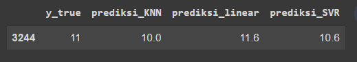

# Laporan Proyek Machine Learning - Zicola VLadimir

## Domain Proyek
Untuk meningkatkan keuntungan dan mereduksi biaya pengeluaran maka penati kepiting wajib mengetahui kapan suatu kepiting harus dipanen, diluar dari ukuran tubuh kepiting itu sendiri. Jika tubuh kepiting masih kecil tetapi usianya sudah cukup maka kepiting tersebut tetap akan dipanen untuk mereduksi biaya pembesaran.

## Business Understanding

Bayangkan ada kepiting yang sudah memasuki usia panen tetapi secara visual mulai dari berat, panjang, dan ukuran lainnya seperti kepiting muda, pada umur dewasa rata-rata makhluk hidup sudah tidak bisa bertumbuh lagi, untuk itu walaupun kepiting tersebut memiliki ukuran yang kecil tetapi telah memasuki usia matang maka kepiting tersebut wajib dipanen sehingga tidak ada lagi biaya untuk memelihara kepiting yang tidak dapat bertumbuh besar lagi, sehingga terjadi peningkatan keuntungan dan pengurangan biaya.

### Problem Statements
Berdasarkan permasalahan diatas, akan dikembangkan suatu sistem untuk memprediksi umur kepiting, adapun rumusan masalah sebagai berikut.
1. Fitur yang paling mempengaruhi umur kepiting?
2. Cara mengetahui umur kepiting dengan fitur tertentu?

### Goals
Untuk menjawab rumusan masalah diatas, maka perlu dibuatkan sistem prediksi dengan goals sebagai berikut.
1. Mengetahui fitur yang paling berpengaruh terhadap umur kepiting
2. Membuat model ML yang akan memprediksi umur kepiting

### Solution
Untuk menyelesaikan masalah tersebut demi mencapai hasil yang diinginkan maka digunakan 3 algoritma. Pertama dimulai dari algortima sederhana yaitu linear regression, kedua menggunakan algoritma KNN, serta  yang terakhir algoritma SVR, lalu diukur dengan metric MAE.

## Data Understanding
Data ini diambil dari kaggle dengan judul crab age predicition yang dirilis 4 bulan yang lalu dengan link berikut [Dataset](https://www.kaggle.com/sidhus/crab-age-prediction).
Data ini berisi  3893 baris dengan 9 kolom dimana 8 kolom sebagai fitur dan 1 kolom target yaitu age.

### Variabel-variabel pada crab age detection dataset adalah sebagai berikut:
1. sex             : jenis kelamin kepiting
2. length          : panjang kepiting
3. Diameter        : diameter kepiting
4. height          : tinggi kepiting
5. weight          : berat kepiting
6. shcuked weight  : berat kepiting tanpa cangkang
7. viscera weight  : berat perut atau bisa juga disebut body fat
8. shall weight    : berat cangkang
9. age             : umur kepiting

Selanjutnya dilakukak dataKepiting.info() untuk mengetahui apakah ada data yang null pada dataset kepiting tersebut dan pada hasil terlihat bahwa tidak ada data yang kosong

selanjutnya dilakukan describe untuk mengetahui nilai min pada dataset, apakah ada nilai fake null yaitu nilai yang tidak secara eksplisit null tetapi nilai tersebut 0. 

setelah dilakukan terlihat bahwa nilai ada nilai yang valuenya 0 sebanyak 2 baris 

Selanjutnya akan di drop kedua data tersebut

Pada sex terdapat 3 jenis kelamin yaitu M untuk male , F utk female dan I untuk indeterminate atau tidak tentu dan distribusi data untuk ke 3 jenis kelamin seimbang 
 

Pada data numerical terlihat bahwa umur paling banyak terdapat di umur 9 bulan, serta berdistribusi normal 
 

Pada pairplot dan heatmap juga terlihat jelas bahwa data cenderung berkorelasi antar 1 sama lain sehingga akan terjadi multicollinearity , dan tidak bisa hanya dihapus karna hampir semua data berkorelasi sehingga diperlukan teknik pereduksian seperti PCA, karna tidak ada teknik untuk memilih fitur mana yang akan di pertahankan dilihat dari masing masing fitur yang saling berkorelasi 

 

## Data Preparation
Tahap 1 One Hot Encoding: mengubah kolom kategori menjadi numerik. Prefix dan pada kasus ini adalah sex lalu juga menggunakan drop_first untuk menghindari multicollinearity sehingga kolom yang dihasilkan hanya 2 ,misal SEX_F pada kasus ini di drop karna jika SEX_I dan SEX_M sama 0 maka dapat dipastikan bahwa sex kepiting tersebut female 
 

Tahap 2reduksi PCA, untuk mereduksi data tersebut serta menghilangkan kolom kolom yang berkorelasi sehingga tidak ada multicollinearity di data tersebut. Adapun sum of explained ratio yang saya pakai adalah minimal 90%. 

Pada grafik diatas terlihat benar bahwa hanya 1 pca yang diperlukan karena memang pada dasarnya semua kolom saling berkorelasi kuat. yang artinya pada dasarnya semua fitur tersebut sama pentingnya untuk menentukan age dan saling berkorelasi sehingga hanya diambil 1 pca saja.

Tahap 3 train test split menjadi data train dan data uji dengan persentase 0.9 dan 0.1 

Tahap 4 standarisasi pada masing masing subset data agar data test tidak menangkap distribusi dari data train sehingga data test akan benar benar independent terhadap data train 

## Modeling
Dalam modelling disini digunakan 3 jenis model yakni linear regression, KNN dan SVR

Linear Regression digunakan sebagai model dasar dikarenakan kesederhanaaan model tersebut sehingga tidak diperlukan waktu lama untuk membuat model tersebut.

Algoritma kedua yakni KNN yang mudah diterapkan dan termasuk lazy learning sehingga tidak ada pelatihan tetapi pemilihan k harus sesuai sehingga tidak terjadi kesalahan dalam prediksi.

Algoritma ketiga yakni SVR yang merupakan salah satu algoritma kompleks yang baik dalam regression dan termasuk ke dalam keluarga SVM.

Pada percobaan ini digunakan semua parameter default dari library sklearn.

Berdasarkan dari pemakaian 3 algoritma ditemukan bahwa SVR menghasilkan nilai MAE terkecil yang artinya menjadi algortima terbaik pada percobaan ini, ditunjukan pada gambar dibawah

## Evaluation
Metric evaluasi yang digunakan adalah MAE atau mean absolute error
adapun rumus MAE sebagai berikut  

 

dilihat dari rumus diatas jika nilai ypred mendekati ytrue maka nilai akan mendekati 0 (semakin kecil maka semakin baik) 

Berdasarkan gambar diatas dapat dilihat bahwa nilai error rata-rata terkecil berada pada algoritma SVR sehingga untuk problem statement ke 2 dapat dipenuhi dengan algoritma SVR  
berikut hasil prediksi 1 data test 

